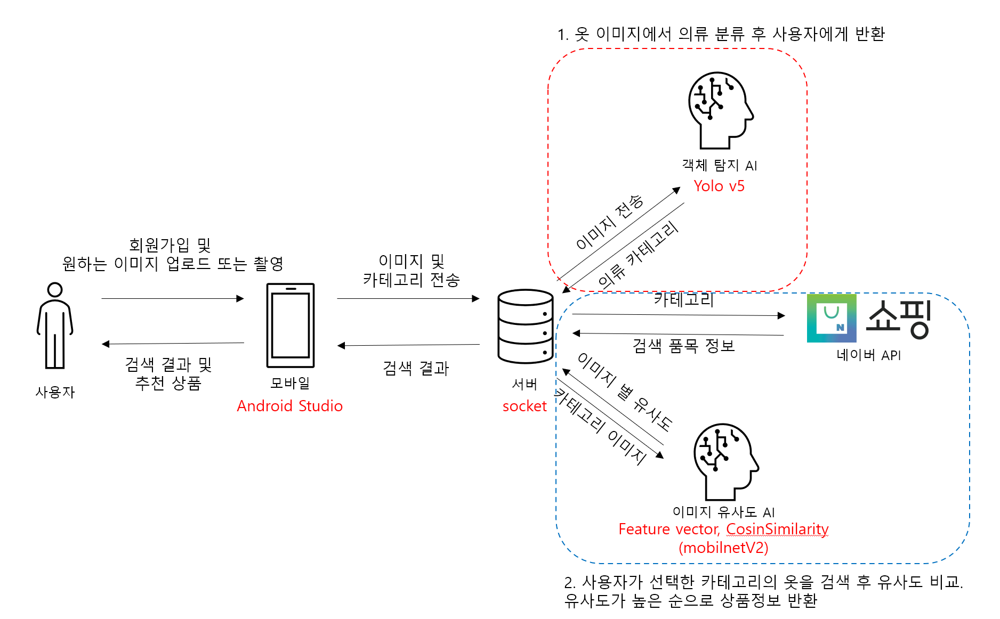

# cloth_finder_socketServer
   

## 소개
교내에서 2022-11에 열리는 Capstone Design 공모전에서 개발하는 "Find Cloth"라는 클라이언트 서버 프로젝트의 서버입니다.      
TV나 인터넷에서 어떤 옷의 정보가 궁금할 때 사용자가 간편하게 이미지로 옷의 정보와 구매 사이트로 연결해주는 서비스입니다.   

- 클라이언트 GitHub: ["https://github.com/HYLogs/cloth_finder_client"](https://github.com/HYLogs/cloth_finder_client)

## 팀 인원
- 박찬규: `JAVA Native Andriod`, `Front End`
- 유현승: `AI`, `YoloV5`
- 이한영: `AI`, `MobileNeV2`, `JAVA Python socket Connet`, `Back End`
 
## 개발환경
- `CUDA`: 11.8
- `python`: 3.10.13
- `pytorch`: 2.1.0+cu118   

## 개요도
